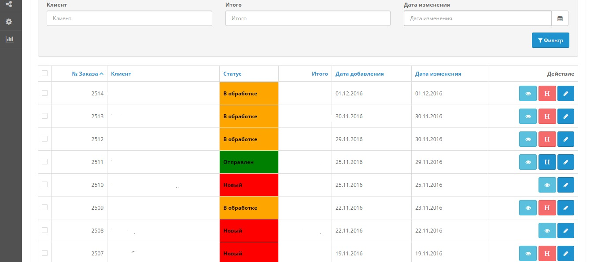

# OrderStatusColored
Colored Status for order list in Opencart 2.3

This module marks your order status by color, this make your marketing more useful.

#How to install

1. Open orderstatuscolored.ocmod.xml in any text editor (but i recommend notepad++)

2. Replace numbers in line like that:
"1" /*Name of new order (change number(only number. don't touch "") for your name of status(work for all languages))*/
replacing sample = ("New order" /*Name of new order (change number(only number. don't touch "") for your name of status(work for all languages))*/)

3. Upload "orderstatuscolored.ocmod.xml" in your Opencart using "Extension->Installer"

4. In "Modifications" press refresh button.

5. Enjoy.

#Screenshot

